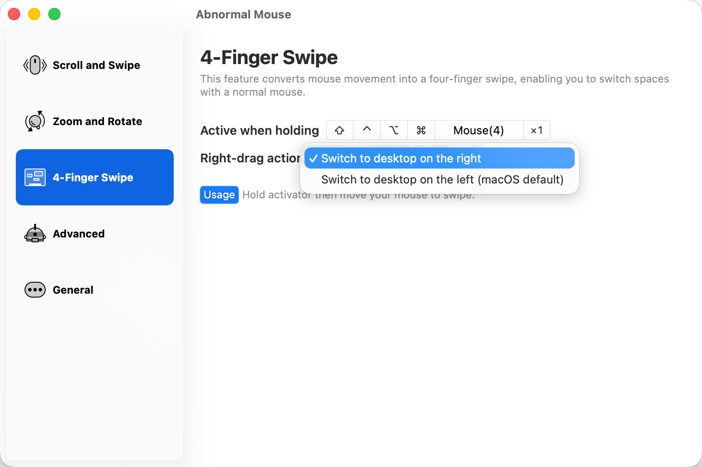

# Abnormal Mouse：右拖方向可选版

这是基于 [Abnormal Mouse](https://github.com/intitni/AbnormalMouseApp) 的功能新增版本。
它把普通鼠标的按住拖动转换为 macOS 四指轻扫，让没有触控板手势的鼠标也能在桌面空间之间连续切换。

本版本新增“向右拖动时”的方向选择：你可以让鼠标向右拖动时切到右侧桌面，也可以保留 macOS 默认的反向切换方式。

主要是因为罗技鼠标原厂的G HUB太难用, 我选择了更好用的第三方软件 = = ,但是这个项目三年前就停更了,这里做一次更新

## 主要改动

- 新增四指轻扫的水平方向选项。
  - 切换到右侧桌面：鼠标向右拖，画面跟随到右侧桌面。
  - 切换到左侧桌面（macOS 默认）：保留原生四指轻扫的方向。
- 默认选择“切换到右侧桌面”。
- 保留连续跟手、半途悬停和松开确认的原生桌面切换效果。
- 关闭官方更新检查，避免自定义版本被官方原版覆盖。

## 设置界面

## 使用方法

1. 打开应用后，在 macOS 的“系统设置 → 隐私与安全性 → 辅助功能”中授权本应用。
2. 在 Logitech G HUB 中，将要用作触发键的侧键设为“使用默认值”，不要为它绑定宏。
3. 打开应用的“4-Finger Swipe（四指轻扫）”页面，点击“Active when holding”设置触发键。
4. 在“Right-drag action（向右拖动时）”中选择需要的方向。
5. 按住触发键并左右拖动鼠标，即可切换桌面空间。

## 适用场景

- 使用 G502 等带侧键鼠标，希望获得类似触控板四指切换桌面的体验。
- 希望鼠标的物理拖动方向与桌面切换方向保持一致。
- 希望在拖动过程中观察桌面切换动画，并在松开前决定是否完成切换。

## 说明

本项目是对原项目的修改，原有的滚动、缩放、旋转等功能仍按原项目逻辑工作。首次安装、重新签名或更换应用位置后，macOS 可能会要求重新授予辅助功能权限。

## 许可证与致谢

本项目基于 [Abnormal Mouse](https://github.com/intitni/AbnormalMouseApp) 修改，并遵循原项目的 [GNU GPL v3.0](LICENSE) 许可证。
